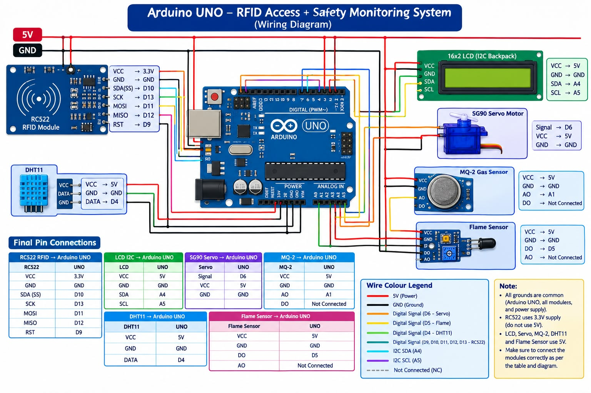

GAURDX: AI-Integrated Security System
1. Abstract
Conventional home security and automation systems rely heavily on rigid, hardcoded sensor thresholds and standalone physical access points. These legacy architectures lack contextual intelligence, predictive decision-making capabilities, and central operational visibility. This project introduces GAURDX, a distributed, agentic smart home and security architecture combining Edge microcontrollers with a centralized local AI processing server. GAURDX delegates local physical access and emergency safety loops to dedicated Edge microcontrollers while streaming real-time telemetry over Wi-Fi and Serial communication to a central Python Flask server. This distributed approach ensures low-latency localized response during emergency conditions while laying a robust foundation for context-aware, LLM-driven automation and predictive security analytics.
2. System Architecture
The GAURDX architecture is organized into three specialized nodes, separating access control, environmental telemetry/automation, and central intelligence.
2.1 Node 1: Smart Access & Edge (Arduino Uno)
Node 1 manages dual-factor physical authentication at access boundaries.

Role: Physical entry verification, credential processing, access logging, and local lock actuation.
Core Components: Arduino Uno, RFID RC522 module, 4x4 Matrix Keypad, I2C 16x2 LCD Display, SG90 Micro Servo Motor, and ESP-01 Wi-Fi Module.
Operational Responsibility: Validates contactless RFID card UIDs and matches sequential 4-digit PIN entries. Communicates credential verification status to the user via the I2C LCD and controls the SG90 Servo motor to toggle door locking mechanisms. Transmits HTTP GET access logs to the local Python AI server via the ESP-01 module.

Refer 

2.2 Node 2: Environment & Automation (Arduino Nano)
Node 2 serves as the environmental sensor matrix and automated feedback controller.

Role: Continuous ambient monitoring, localized hazard mitigation, and telemetry transmission.
Core Components: Arduino Nano, DHT11 Temperature & Humidity Sensor, MQ Gas Sensor, Flame Sensor, Soil Moisture Sensor, DS3231 Real-Time Clock (RTC), 1-Channel Relay Module (Water Pump Control), and L298N Dual H-Bridge Motor Driver (Window Blinds Control).
Operational Responsibility: Executes a 2-second continuous polling loop to read ambient parameters. Implements deterministic, real-time safety fail-safes (e.g., immediate venting upon gas/flame detection, automated plant irrigation based on soil moisture). Formats all sensor metrics and timestamp data into JSON payloads for upstream transmission over Serial.
2.3 Node 3: Local AI Brain (Python Server)
Node 3 provides centralized data aggregation, API endpoints, logging, and smart decision processing.

Role: RESTful API hosting, telemetry logging, operational database maintenance, and intelligence server.
Software Stack: Python 3, Flask framework.
Operational Responsibility: Hosts a lightweight local web server on port 5000. Features dedicated REST endpoints (/api/access-log and /api/telemetry) to process HTTP GET requests from Node 1 and JSON payloads from Node 2. Stores structured logs in local CSV files and serves as the integration interface for future machine learning and LLM models.
3. Hardware Implementation & Interfacing
3.1 Component Matrix
Category
Component Description
Core Specifications / Function
Microcontrollers
Arduino Uno & Arduino Nano
ATmega328P architecture, 16 MHz clock speed, 5V logic operation
Networking
ESP-01 Wi-Fi Module
ESP8266 SoC, 802.11 b/g/n support, 3.3V logic level
Sensors
RFID RC522 Module
13.56 MHz SPI interface, contactless card authentication

DHT11 Sensor
Digital temperature and humidity sensing

MQ Series Gas Sensor
Analog hazardous gas detection

IR Flame Sensor
Digital / Analog infrared fire detection

Soil Moisture Sensor
Analog resistive moisture sensing

DS3231 RTC Module
High-precision I2C Real-Time Clock with battery backup
Actuators & Interfaces
4x4 Matrix Keypad
Keypad matrix for user PIN input

I2C 16x2 Character LCD
PCF8574-based display interface for visual system status

SG90 Servo Motor
5V PWM micro servo for electronic door lock actuation

1-Channel Relay Module
5V optocoupled relay controlling external water pump

L298N Motor Driver
Dual H-Bridge driver powering window blind motorized assembly

Active Buzzer
Audible local emergency alarms and feedback chimes

3.2 Critical Electrical & Logic Constraints
Logic Level Matching (3.3V vs. 5V):
ESP-01 Wi-Fi Module: Operating strictly at 3.3V logic, the ESP-01 RX pin is sensitive to 5V signals from the Arduino Uno TX pin. A passive resistor voltage divider (1kΩ and 2kΩ) is placed between Arduino Uno SoftwareSerial TX (5V) and ESP-01 RX (3.3V) to prevent overvoltage degradation.
RFID RC522 Module: The RC522 IC operates strictly at 3.3V VCC and logic levels. SPI data lines (SCK, MOSI, MISO, SDA) connected to the Arduino Uno require direct 3.3V power routing from the onboard regulator and logic attenuation where appropriate.
Power Distribution Infrastructure:
High-current inductive loads (L298N motor driver, water pump relay, and SG90 servo motor) are powered directly from an external regulated 12V/5V DC supply rather than drawing current from microcontroller pins, preventing unexpected thermal resets and brownout conditions.
4. Software & Communication Protocols
4.1 Bus Communication Protocols
I2C Protocol (Inter-Integrated Circuit): Utilized by the 16x2 LCD (via PCF8574 adapter) and DS3231 RTC module on shared SDA/SCL lines. Reduces pin utilization on microcontrollers to two shared wire lines.
SPI Protocol (Serial Peripheral Interface): Utilized for high-speed synchronous serial data transfers between Arduino Uno and the RFID RC522 module using SS (Slave Select), SCK, MOSI, and MISO lines.
4.2 Inter-Node & Server Protocols
UART / SoftwareSerial Communication: The Arduino Uno employs SoftwareSerial on dedicated digital pins to manage AT commands and HTTP communication with the ESP-01 module at a 9600 baud rate.
HTTP GET Protocol: Node 1 sends formatted HTTP GET requests over Wi-Fi through the ESP-01 module to Node 3.
Example Endpoint: GET /api/access-log?uid=A3F1B290&status=SUCCESS HTTP/1.1
JSON Serialization Over Serial: Node 2 structures its telemetry output into standardized JSON strings sent over USB/UART Serial to Node 3.

{

  "timestamp": "2026-09-25 22:43:00",

  "temperature_c": 26.5,

  "humidity_pct": 58.0,

  "gas_level_ppm": 120,

  "flame_detected": false,

  "soil_moisture_pct": 42.0,

  "pump_active": false,

  "vent_status": "CLOSED"

}

5. Workflow & System Logic
5.1 Dual-Factor Authentication Workflow (Node 1)
System resides in an IDLE state displaying operational status on the I2C LCD.
User swipes an RFID tag across the RC522 reader.
Node 1 reads and compares the card UID against the authorized credential database.
If the RFID UID is invalid, it triggers an error chime, logs the entry failure via ESP-01, and resets.
If the RFID UID is valid, it prompts the user for a 4-digit PIN via the 4x4 Matrix Keypad on the LCD display.
User inputs the PIN; keypad entries are masked for privacy.
Upon PIN confirmation:
Match Success: Actuates SG90 Servo to 90° (Door Unlock), displays a welcome message, transmits an HTTP GET success log to the Python server, waits 5 seconds, closes the servo, and returns to IDLE.
Match Failure: Displays an access denied warning, increments the failed attempt counter, sends a failure log to the Python server, and locks out input if the retry threshold is exceeded.
5.2 Environmental Fail-Safe Control Loop (Node 2)
Initialize the DS3231 RTC and sensor interfaces; start a non-blocking 2-second timer loop.
Sample readings from DHT11, MQ Gas Sensor, Flame Sensor, and Soil Moisture Sensor.
Safety Priority Check 1 (Fire / Gas Hazard):
If Flame Sensor == LOW OR Gas Sensor > Threshold:
Immediately actuate L298N driver to open window blinds (Emergency Venting).
Sound local audible alarm buzzer.
Flag emergency condition in telemetry payload.
Safety Priority Check 2 (Automated Irrigation):
If Soil Moisture < Dry Threshold AND Flame/Gas Hazard == FALSE:
Trigger 1-Channel Relay to start Water Pump for scheduled irrigation pulse.
Telemetry Dispatch:
Construct JSON payload containing sensor metrics, timestamp from DS3231, and actuator state flags.
Serialize payload over USB Serial interface to Node 3.
6. Future AI Integration Strategy
While current system operations utilize deterministic fail-safes and structured CSV logging, Node 3 is architected to transition into an autonomous agentic decision engine.
6.1 Local Large Language Model (LLM) Integration via Ollama
Local Inference Engine: Host open-weights models (e.g., Llama 3 / Phi-3 via Ollama) locally on Node 3 to operate fully offline, maintaining high execution speed, reliability, and complete data privacy.
Natural Language Interface: Allow users to query system state and execute complex routines in natural language (e.g., "Show ambient temperature trends over the last 4 hours and flag any security anomalies").
6.2 Predictive Automation & Anomaly Detection
Context-Aware Threshold Adjustments: Replace hardcoded temperature/humidity/gas limits with machine learning models that account for seasonal drift, time-of-day variations, and user presence patterns.
Behavioral Security Analytics: Analyze access logging timing patterns to detect unusual entry attempts, automatically tightening authentication parameters or alerting homeowners during abnormal hours.
Predictive Maintenance: Monitor water pump run cycles and sensor noise levels to predict component degradation before hardware failure occurs.

Schematic diagram

Conclusion
The GAURDX architecture successfully demonstrates a hybrid engineering approach, combining real-time edge responsiveness with centralized intelligence. By decoupling low-level access control and environmental fail-safes from cloud dependencies, GAURDX maintains maximum reliability and physical security while providing an extensible server structure ready for local edge AI and LLM orchestration.
